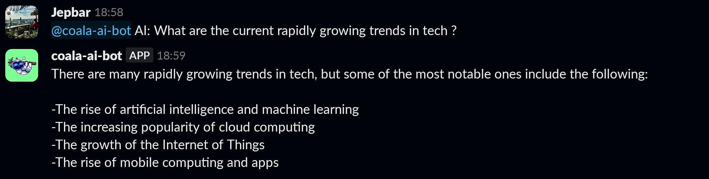

# coala-ai-bot 🐨🤖

**coala-ai-bot** is a slack bot which answers your questions by using openAI



---

## How to set up bot?

> First, clone the repo. You need to create `config.json` file where we will store our env variables (as shown in `config-sample.json`)

coala-ai-bot uses [OpenAI](https://openai.com/api/) API for answering the questions. That is why you need to add API key to access it. To get that, sing up to OpenAI and get API_KEY from there. Then copy your API_KEY and paste it as value of `"open_ai_api_key"` in `config.json`

To create Slack bot we used a [Slacker](https://github.com/shomali11/slacker) freamework which is built on top of the Slack API https://github.com/slack-go/slack. To get started, you must have or create a [Slack App](https://api.slack.com/apps?new_app=1) and enable `Socket Mode`, which will generate your app token (`"slack_app_token"` in the `config.json`) that will be needed to authenticate. Follow this steps after creating Slack App (from scratch):

- Select `Socket Mode` on the menu on the left and Enable Socket Mode. It will ask you to generate token, name token as you want and generate it.
- Copy generated token and add it to `config.json` file as `"slack_app_token"`.
- Go to `Event Subscribtions` on the menu and Enable Events. Then find `Subscribe to bot events` section and add common event subscribtions for bots `app_mention` and `message.im`. Click to `Save changes` button below.
- Now, go to `OAuth & Permissons` and find `Scopes` section. Here you can add or remove scopes depending on bots purpose. For _coala-ai-bot_ add following scopes:basarjagma
  - `app_mentions:read`
  - `channels:history`
  - `chat:write`
  - `groups:history`
  - `im:history`
  - `mpim:history`
- After selecting your scopes, navigate to the top of `OAuth & Permissions` and install app to your workspace. Then you can get OAuth token which you need to add as `"slack_bot_token"` to `config.json`

> **NOTE:**
>
> - You must reinstall app to the workspace once you did some changes in the settings
> - You can add other scopes or events subscribtions depending on your bots purpose. Check out the documentation for more information about [events](https://api.slack.com/events) and [scopes](https://api.slack.com/scopes).

Once you have created `config.json` file with `"open_ai_api_key"`, ` "slack_app_token"` and `"slack_bot_token"` you can start a bot. Run the following commands in the terminal:

```
go mod tidy

go run main.go
```

---

Add the bot to slack channel, and type by mentioning it `AI: What is the capital of Morocco`. Bot will response back with the answer Rabat (whenever you mention bot in the chat, it will search for `AI: <question>` command).
